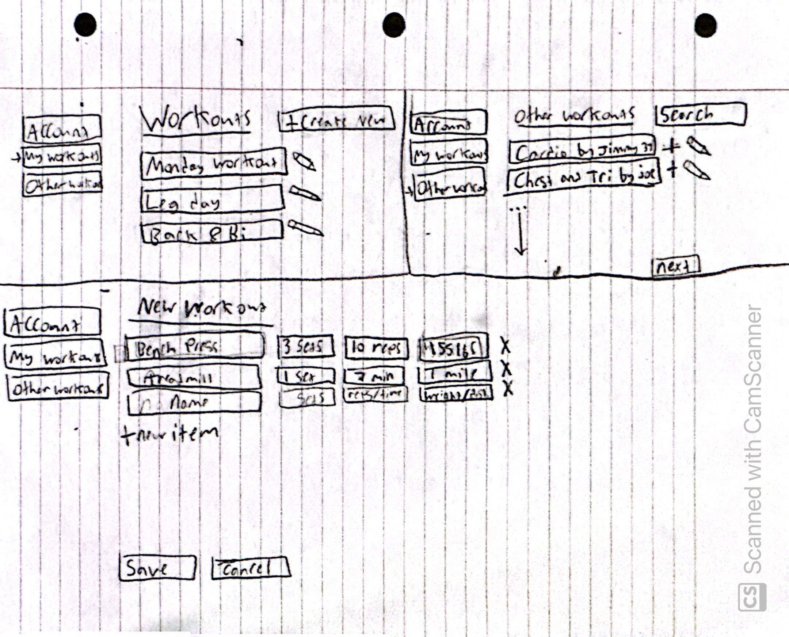

# Workout Builder/Tracker
## Elevator Pitch
Need a new website to track your workouts? Look no further, this SmartWorkouts allows you to create custom workouts, and then log what you were able to do. Whether that be amount of time, weights, sets, or any other method of recording your workouts that you'd like. You can post your workouts for others to view, and you can also access workouts that were previously posted. No more having to write on notes, apps, or use other predetermined workouts; everything can be set by you! Go at your own pace, and see the growth start to build.

## Key Features
* Private accounts
* Create Custom Workouts
* Keep track of each workout completed, and record what you were able to do and when
* Post your workouts for others
* Access previously posted workouts and use/modify them
* Counter on each workout which states how many people viewed it and how many saved it to their own account to use
  
## Technologies
### Authentication
Users will have their own accounts where they will be able to store their workouts, record what they did, and view other workouts on the site
### Database data
Personal workouts will be stored in a database, as well as the data from what they did. Everytime a user posts a workout, they will be stored online for anyone to access.
### WebSocket data
There will be a view counter and a download counter, which shows how many people viewed a workout and how many people saved it to their own account to use

## Rough Draft

Image shows a few different potential web pages

## Deliverables
### HTML

- **HTML pages** - I have 6 HTML pages; A home page, an about page, an account detail page, a list of personal workouts, a catalog of other workours, and a workout information page
- **Links** - The login page will take you to your personal workouts. There are labeled links that go to all the other pages in almost all the pages, including the github link. Only the workout catalog and user workouts can take you to view a specific workout
- **Text** - Full text in the about page, other pages have texts showing were things will be and explaining some things
- **Images** - Home page has an image of a muscular arm
- **DB/Login** - You can login in the home page. The user workouts and workout catalog will get their workouts from the database
- **WebSocket** - The workout shows placeholders for the websocket data which will show live updates to the views and downloads of the workout
- **3rd Party Element** - Added Placeholder in the about page

### CSS
- **Prerequisite** - Simon CSS deployed to your production environment -> Done
- **Prerequisite** - A link to your GitHub startup repository prominently displayed on your application's home page ->Done(scroll to bottom)
- **Prerequisite** - Notes in your startup Git repository README.md file -> Done
- **Header, footer, and main content body** - Used CSS and Bootstrap to design and format the headers & footers, and also made custom main bodies for all web pages
- **Navigation elements** - The links change color on hover, the current page is in bold
- **Responsive to window resizing** - Auto adjusts when I adjusted size to iphone and ipad dimensions through inspect element
- **Application elements** - Used bootstrap for the buttons
- **Application text content** - Text is within translucent boxes over the background image
- **Application images** - I added background images to every page, and overlayed the content on top
